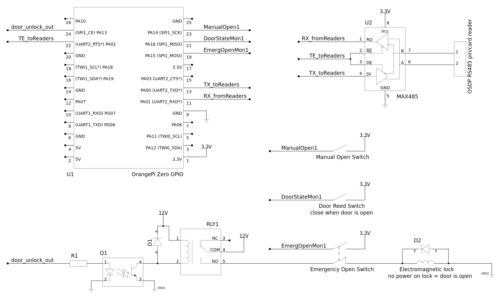

This is Access Control system for Linux based single board computers (e.g. Orange Pi Zero)
and OSDP readers (e.g. Idesco ....) or EPSO readers (eg. Roger ....).

It provide own libraries for [OSDP](https://www.securityindustry.org/industry-standards/open-supervised-device-protocol/) and [EPSO](http://www.alse.ro/wp-content/uploads/2017/03/EPSO2-Protocol-v2.29-Rev.D.pdf).

## install

1. install *libsqlite3-dev* and *libgpiod-dev* (`apt install libgpiod-dev libsqlite3-dev`)
2. build access control application by run `make kd-idesco` or `make kd-roger`
3. install aplication, systemd service, configs, database:
```
cp build/kd-idesco.elf /usr/local/bin/AccessControl

cp share/AccessControl.service /etc/systemd/system/
cp share/config /etc/kd-config
cp share/kd-database /var/lib/kd-database

systemctl enable AccessControl
systemctl start AccessControl
```

### Orange Pi Zero and Armbian Bullseye

1. Add `uart2 uart2_rts_cts` to `overlays=` line in `/boot/armbianEnv.txt` and add line `param_uart2_rtscts=1` to this file.
2. Build a kernel with the patch enabling RS485 half-duplex transmitter control support via RTS for 8250-dw uart compatible chips with active wait for end transmission (no interrupt at empty shift register on Orange Pi Zero):
	* [minimal patch for 5.10 kernel](docs/rs485-8250_dw-minimal_for_5.10.diff)
	* [Armbian forum discussion and more advanced patch for kernel <= 5.7](https://forum.armbian.com/topic/13562-rts-signal-and-uart2-init/)
	* [Armbian kernel build instruction](https://docs.armbian.com/Developer-Guide_Build-Preparation/)

#### Typical application




## history

This projects start as merge code from two [ICM UW](http://icm.edu.pl/) projects:

1. OSDP implementation on Orange Pi zero (2019)
2. Roger RFID reader based access control system (2013)

See [LICENSE](LICENSE) file for details.
